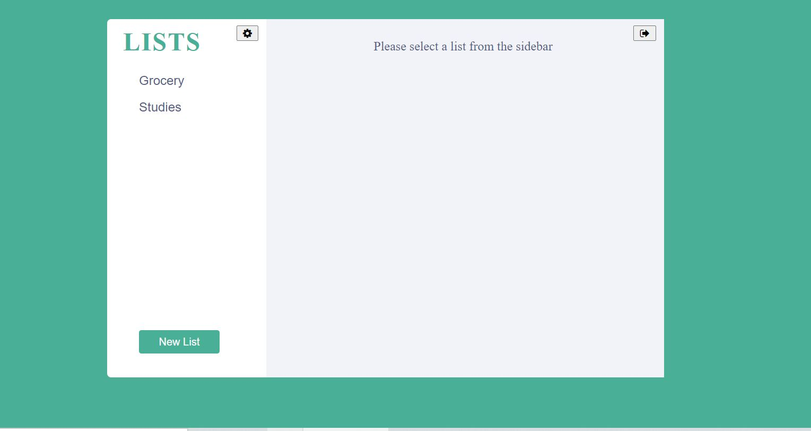
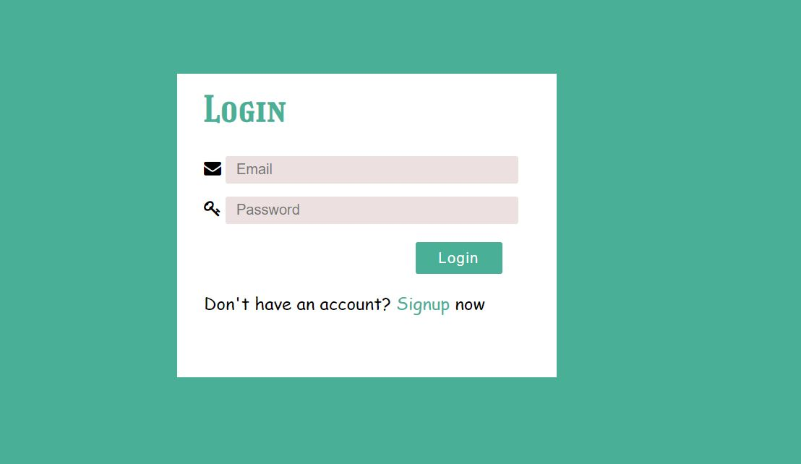
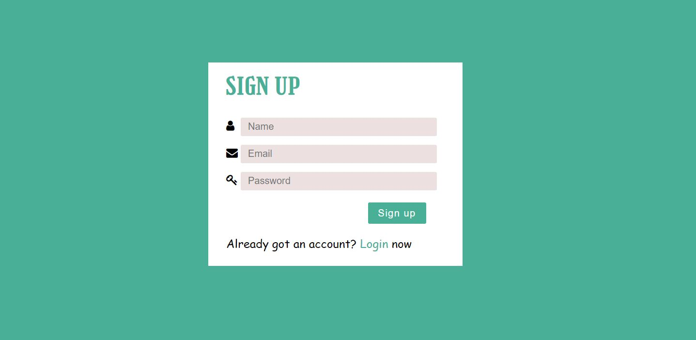
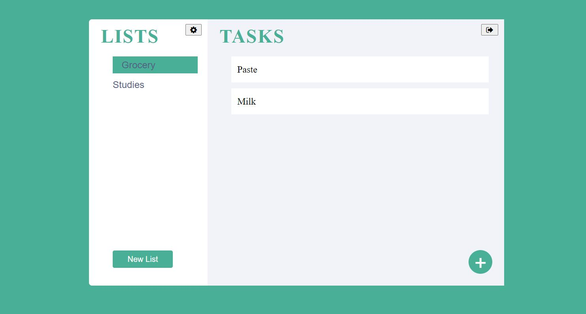
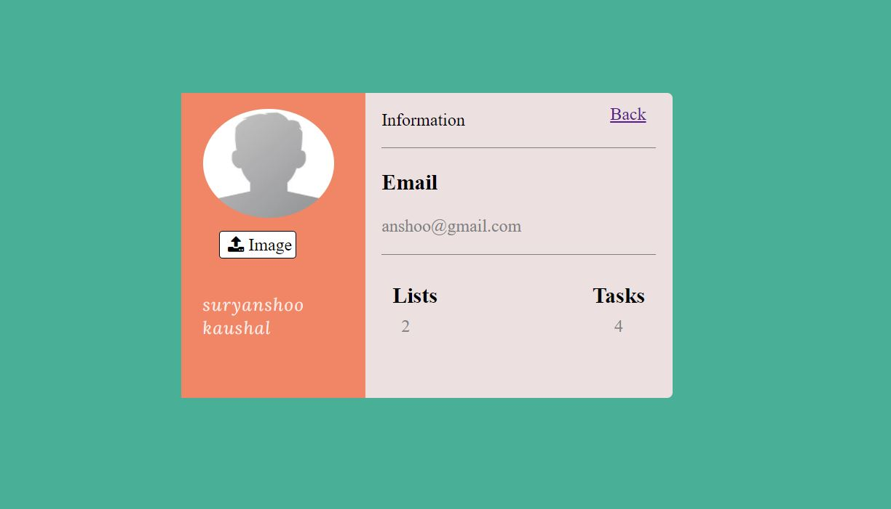

# Task Manager App

# User Authentication System(Login/Signup)
 / 

# Main Dashboard Page for the user

# Profile page for the user:
    - Users can upload their profile pics.
    - Here there will be a count of all their list items and their tasks

